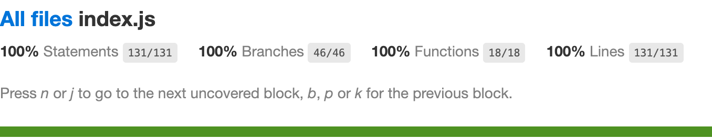

# `file-parser`

## Description

`file-parser` is a file parser CLI.

Given the following input:

```
/*Files*/
Batch: 99
Description: Payroll for January
==
Transaction: 301
Originator: 111222333 / 9991
Recipient: 444555666 / 123456
Type: Credit
Amount: 10000
==
Comment: Payment for invoice 100
Transaction: 302
Originator: 111222333 / 9991
Recipient: 123456789 / 55550
Type: Credit
Amount: 380100
==
Transaction: 305
Originator: 111222333 / 9992
Recipient: 444555666 / 8675309
Type: Debit
Amount: 999
```

This will be the output:

```
{
  "batch": 99,
  "description": "Payroll for January",
  "accounts": [
    {
      "routing_number": "111222333",
      "account_number": "9991",
      "net_transactions": -390100
    },
    {
      "routing_number": "444555666",
      "account_number": "123456",
      "net_transactions": 10000
    },
    ...
  ]
}
```

## Requirements

You must have Node installed.
If you'd like to run the tests, you must have Yarn or npm installed.

## How to Use

```sh
./file-parser < example-data.bdi
```

## Test Coverage



## Run the Tests

Before running tests, run `yarn install` or `npm install`.
If you're using Yarn, do the following:

```sh
yarn test
```

If you're using npm, do the following:

```sh
npm run test
```
